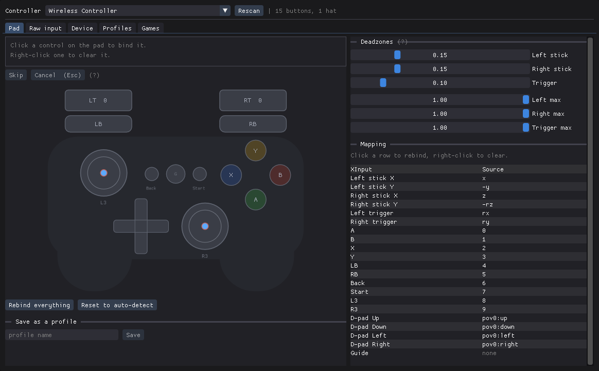
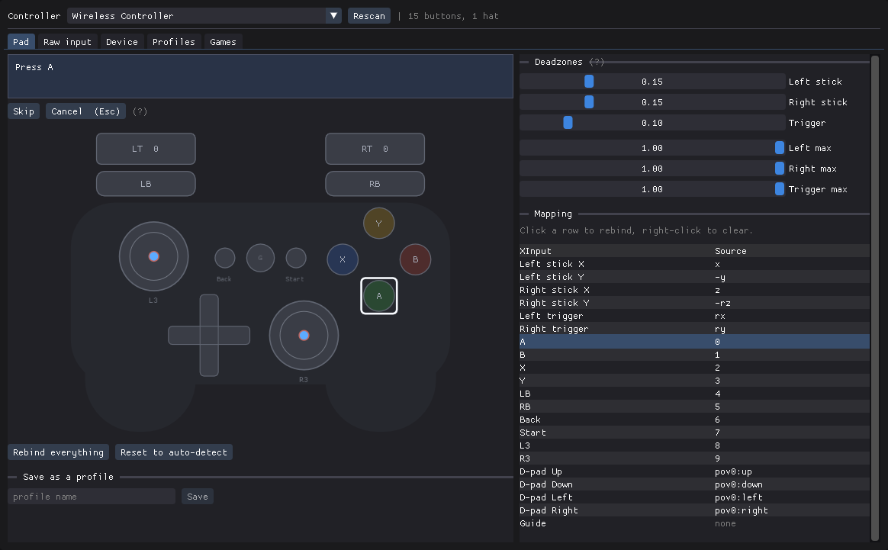
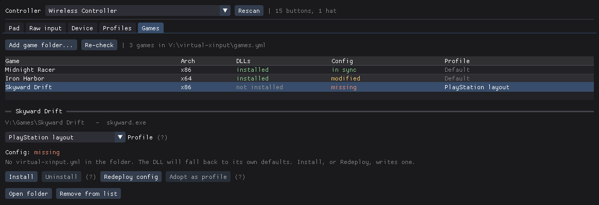
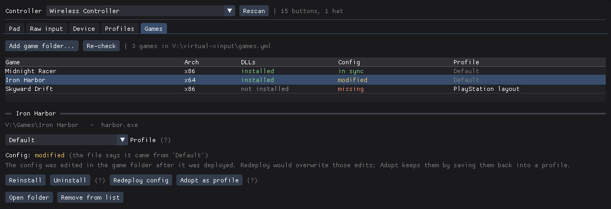
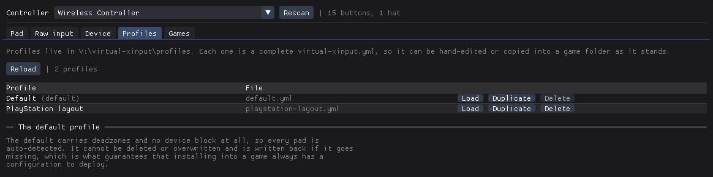
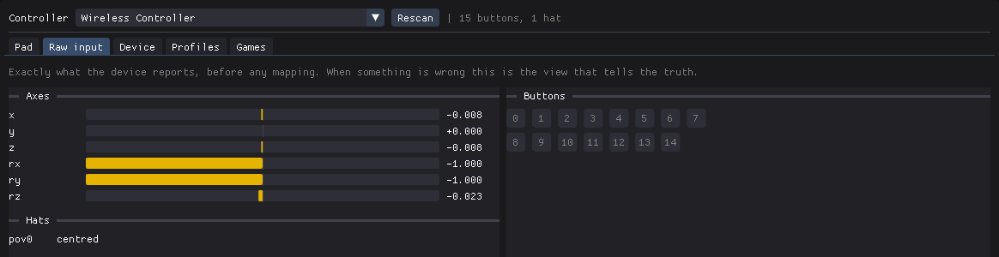

# virtual-xinput

Play old PC games that only understand Xbox controllers with the gamepad you
already have: a PlayStation pad, a Logitech, a generic USB controller.

Many games from the Xbox 360 era talk to controllers through Microsoft's
**XInput** and ignore everything else. virtual-xinput is a small file that sits
in the game's folder and makes your pad look like an Xbox controller to that
one game. Nothing is installed on your system: no driver, no service, nothing
running in the background. Remove the file and the game is exactly as it was.



## Before you start

- **While it's installed in a game, that game sees only the pads virtual-xinput
  maps.** A real Xbox controller becomes invisible to that game until you
  uninstall.
- **Never install it into an online game with anti-cheat** (EasyAntiCheat,
  BattlEye, Vanguard and the like). Anti-cheat looks for exactly this kind of
  file, and you risk a ban. virtual-xinput is meant for old single-player
  games.

## Download

Get the newest build from the
[Releases page](https://github.com/kd-11/virtual-xinput/releases), or download
it directly:
[virtual-xinput.zip](https://github.com/kd-11/virtual-xinput/releases/download/latest/virtual-xinput.zip).

Unzip it anywhere you like, e.g. a folder in Documents or a USB stick. The
folder is self-contained, and your game list and profiles are saved inside it,
so you can move it later.

## Using it

Plug in your controller and run **`virtual-xinput-gui.exe`**.

### 1. Check your controller

Choose your controller from the **Controller** list at the top. The **Pad** tab
shows a drawn Xbox controller that copies your real one, so move the sticks,
pull the triggers and press the buttons while you watch it.

If every control lights up in the right place, the pad already works and you
can skip to [step 3](#3-install-into-a-game). Most pads get the sticks and
triggers right by themselves. The buttons are what usually need fixing: on
PlayStation-style pads, A/B/X/Y often come out rotated.

### 2. Fix anything that's wrong



- **Click a control on the drawn pad** to rebind it. The prompt at the top says
  what to do ("Press A", "Push the LEFT stick RIGHT").
- **Leave the controller alone while the bar fills.** It's reading the resting
  position first. Then do what the prompt asks.
- Clicking a stick asks for both of its directions in turn. Clicking the
  **ring around** a stick binds pressing the stick in (L3/R3).
- **Right-click** a control to clear it. **Skip** passes over a control your pad
  doesn't have.
- **Rebind everything** walks you through every control in turn. **Reset to
  auto-detect** throws away your changes.

The **Deadzones** sliders on the right take effect immediately:

- Character walks on its own: raise **Left stick**.
- A stick never reaches full speed: lower **Left max** / **Right max**.

When it's right, type a name under **Save as a profile** and click **Save**.

### 3. Install into a game



1. Open the **Games** tab and click **Add game folder...**
2. Pick the folder the game's `.exe` is in, not a shortcut or the launcher. If
   the folder has several programs, choose which one is the game, then click
   **Add**.
3. Select the game in the list and choose a **Profile**. Leave it on `Default`
   if your pad worked without changes in step 1.
4. Click **Install**, then start the game normally.

virtual-xinput works out on its own whether the game is 32-bit or 64-bit and
copies the matching files. Getting this wrong by hand is the most common reason
a manual install silently does nothing.

The list tells you each game's state at a glance:

| Column | What it tells you |
|---|---|
| **DLLs** | `installed` / `not installed` in the game folder |
| **Config** | whether the game's settings match its profile (see below) |
| **Profile** | which saved mapping the game uses |

To remove it from a game, select the game and click **Uninstall**. Only the
files virtual-xinput put there are removed. Your settings file is left behind
in case you want it again.

### Keeping games up to date



If you edit a profile after installing, or someone edits the settings file in
the game's folder, the **Config** column tells you:

| State | Meaning |
|---|---|
| **in sync** | Everything matches. Nothing to do. |
| **out of date** | The profile has changed since you installed. Click **Redeploy config**. |
| **modified** | The file in the game folder was edited by hand. |
| **missing** | No settings file. The game uses built-in defaults. |

For a **modified** game you choose which copy wins: **Redeploy config**
overwrites the edits with the profile, and **Adopt as profile** saves the
edited file as a new profile you can reuse in other games.

### Profiles



A profile is a saved mapping. **Load** it into the Pad tab to adjust it,
**Duplicate** it to make a variation, or **Delete** it. The `Default` profile
auto-detects every pad and can't be removed, so there's always a profile to
install.

### When the pad acts strangely



**Raw input** shows exactly what your controller reports before any mapping,
and **Device** shows what Windows knows about it, including whether it supports
rumble. If a control doesn't respond in the Pad tab, check here whether the
controller is sending anything at all.

## Common problems

| Problem | Try this |
|---|---|
| The game doesn't see the controller | Install through the **Games** tab rather than copying files by hand: it picks the right 32/64-bit version. |
| A/B/X/Y are in the wrong places | Rebind them on the **Pad** tab (step 2) and redeploy. |
| The character drifts on its own | Raise the **Left stick** deadzone. |
| Triggers are half-pressed at rest | Rebind the triggers on the **Pad** tab. |
| No rumble | Many pads only rumble through their own driver, which virtual-xinput can't reach. The **Device** tab tells you. |
| Your Xbox controller stopped working in that game | Expected while installed. Uninstall to get it back. |
| Settings changes do nothing | The game reads its settings at startup. Restart the game. |

More fixes, and the reasons behind them, are in the
[troubleshooting section](docs/documentation.md#troubleshooting) of the full
documentation.

## Command line

`virtual-xinput-config.exe` does everything the window does from a command
prompt, for scripting or for machines without Direct3D 11:

```
virtual-xinput-config add "C:\Games\Some Old Game"
virtual-xinput-config install 0
```

Run it with no arguments for an interactive menu. See
[Managing games](docs/documentation.md#managing-games) for all commands.

## Building from source

You need:

- Windows 10 or 11
- **Visual Studio 2026 or 2022** with the *Desktop development with C++*
  workload
- **CMake 3.20+** on your `PATH`

Then, from the repository folder in PowerShell:

```powershell
.\build.ps1
```

This builds the 32-bit and 64-bit versions, runs the tests, and puts a ready-to-use
copy in `dist\`, the same folder you'd get from the download. Your game list and
profiles in `dist\` survive rebuilds, even failed ones.

| Option | What it does |
|---|---|
| `-Clean` | Delete `build\` and `dist\` first for a from-scratch build |
| `-NoTests` | Skip the test run |
| `-NoAliases` | Build only `xinput1_3.dll`, not the extra XInput versions some games ask for |
| `-Verbose` | Show the full compiler output (useful when a build fails) |
| `-Generator "<name>"` | Use a different Visual Studio. Defaults to `"Visual Studio 18 2026"`. With VS 2022, pass `-Generator "Visual Studio 17 2022"` |

### Releases

Every push to `main` builds and publishes the `latest` pre-release
automatically, and pushing a tag such as `v1.2.0` publishes a permanent
release. See [.github/workflows/release.yml](.github/workflows/release.yml).

## Documentation

Everything else is in the **[full documentation](docs/documentation.md)**:

- the configuration file format and every option
- profiles, the game library and how config syncing works
- force feedback (rumble) and which pads support it
- the detailed troubleshooting table
- how the wrapper works inside the game, and why
- caveats and known issues: read these before deciding something is broken
- building by hand with CMake, and the test suite
